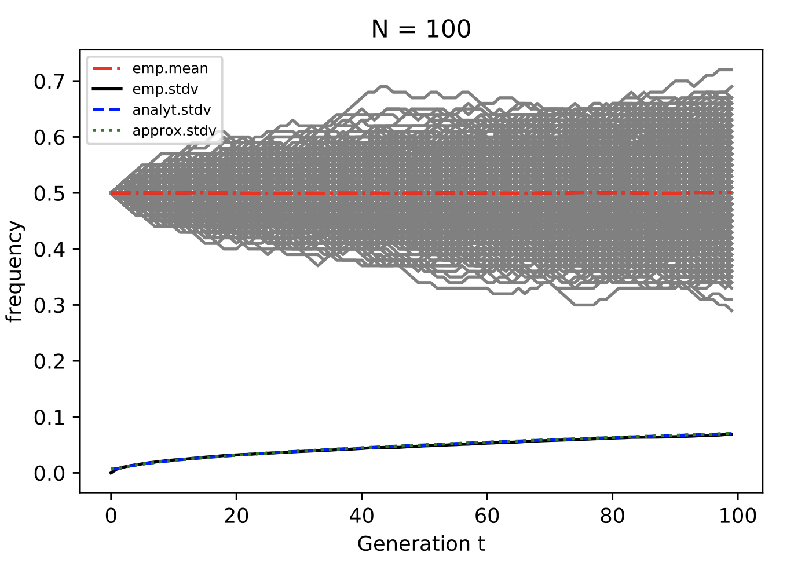
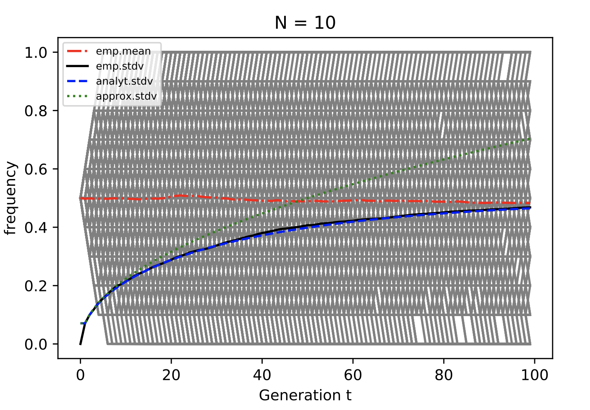

```{r setup, include=FALSE, warning=F}
#knitr::opts_chunk$set(echo = TRUE)
#source("draw_matrix.R")
```

## Problem 1

### a)

By the properties of the neutral Moran process, we know that the population size is constant and both A and B has the same of probablity of reproduction and death.

Assumed that at time $t-1$, the number of of A in the population is ($X(t-1) = i, t > 1$).

The transition probability for individuals of allele A in the population: $P_{i,i-1} = P_{i,i+1} = p(1-p), P_{i,i} = p^2 + (1-p)^2, p = \frac{i}{N}$

$$
E[X(t) \mid X(t-1)=i] = i \cdot P_{i,i-1} + (i-1) \cdot P_{i,i+1} + (i+1) \cdot P_{i,i} = i = X(t-1)
$$

By law of total expectation, $E[X(t)] = E_{X(t-1)}[E_{X(t)}[X(t) \mid X(t-1)]] = i$ and hence the stationary mean.

### b)

\begin{align*}
V_1 
&= Var[X(1) \mid X(0) = i] \\
&= E[X(1)^2 \mid X(0) = i] - (E[X(1) \mid X(0) = i])^2 \\
&= i^2 \cdot P_{i,i} + (i-1)^2 \cdot P_{i,i-1} + (i+1)^2 \cdot P_{i,i+1} - i^2 \\
&= -2\cdot\frac{i}{N}(1 - \frac{i}{N}) \cdot i^2 + ((i+1)^2 + (i-1)^2) \cdot \frac{i}{N}(1 - \frac{i}{N}) \\
&= 2\frac{i}{N}(1 - \frac{i}{N})
\end{align*}

$Var[X(t) \mid X(t-1) = i] = Var[X(1) \mid X(0) = i] = 2\frac{i}{N}(1 - \frac{i}{N}),\ \forall t > 0$ follows from the fact the $X(t) \mid X(t-1)$ is identically distributed for all $t$

By the law of total variance:
\begin{align*}
Var[X(t)]
&= E_{X(t-1)}[Var_{X(t)}[X(t)\mid X(t-1)]] + Var_{X(t-1)}[E_{X(t)}[X(t)\mid X(t-1)]] \\
&= E_{X(t-1)}[2\frac{X(t-1)}{N}(1 - \frac{X(t-1)}{N})] + Var[X(t-1)] \\
&= 2\frac{E_{X(t-1)}[X(t-1)]}{N}(1 - \frac{E_{X(t-1)}[X(t-1)]}{N}) - \frac{2}{N^2}Var[X(t-1)] + Var[X(t-1)] 
\quad E[A^2] = Var[A] + (E[A])^2\\
&= 2\frac{E_{X(t-1)}[X(t-1)]}{N}(1 - \frac{E_{X(t-1)}[X(t-1)]}{N}) + (1-\frac{2}{N^2})Var[X(t-1)] \\
&= V_1 + (1-\frac{2}{N^2})Var[X(t-1)] 
\end{align*}

if $X(0) = i$, we can rewrite the equation as 
\begin{align*}
Var[X(t)] - \frac{V_1}{\frac{2}{N^2}} 
&= (1 - \frac{2}{N^2})(Var[X(t-1)] - \frac{V_1}{\frac{2}{N^2}}) \\
&= (1 - \frac{2}{N^2})^{t-1}(V_1 - \frac{V_1}{\frac{2}{N^2}})
\end{align*}

We have $Var[X(t)] = V_1\frac{1 - (1 - \frac{2}{N^2})^t}{\frac{2}{N^2}}$.

### c)

if $X(0) = i$, we can rewrite the equation as $N \to \infty$
\begin{align*}
\lim_{N\to \infty} Var[X(t)] 
&= \lim_{N\to \infty} V_1 + (1-\frac{2}{N^2})Var[X(t-1)] \\
&= V_1 + Var[X(t-1)]
\end{align*}

By induction We have $Var[X(t)] = tV_1$.


### d)

```{r eval=FALSE, include=FALSE}
N <- 100
v <- rep(90, 1000)
length(v)
stimulateMoran <- function(A, N, seed=1233) {
  # p is array of 
  for (i in 1:999){
    p = A[i]/N
    prob = c(p*(1-p), p*(1-p), p^2 +(1-p)^2)
    ran = sample(c(-1,1,0), prob=c(0.1, 0.2, 0.7), size=1)
    A[i+1] = A[i] + ran
    if (A[i+1] >= N) {
      A[i+1] = 100
    }
  }
  
  return(A)
}
A_pop <- stimulateMoran(v, N)
```




The figure shows the frequency of a certain allele in a Moran process with population size $100$ and $10$, empirical mean, variance along with analytical ones were plotted in the graph.

## Problem 2

### a)

We know from the problem above that the $X(t)$ is a Markov chain. We can aslo know that $X(t)$ will reach a stationary distribution thanks to ergodicity.

Let $y_i = x_i - x_{i-1}$, we have $x_j = \sum_{i=1}^j = y_i$.

we also have: $x_i = P_{i,i-1}x_{i-1} + P_{i,i+1}x_{i+1} + (1-P_{i,i+1} - P_{i,i-1})x_i$ by the stationary distribution.

This can be further simplified into: $\beta_i(x_i - x_{i-1}) = \alpha_i(x_{i+1} - x_i) \Rightarrow \beta_i y_i = \alpha_i y_{i+1}$.

Let $\gamma_i = \frac{\beta_i}{\alpha_i}$, we have $y_j = x_1 \cdot \frac{\beta_1}{\alpha_1}\cdots\frac{\beta_{j-1}}{\alpha_{j-1}} = x_1\prod_{k=1}^{j-1}\gamma_k$

We have:
$$
x_j = \sum_{i=1}^jy_i = x_1 + x_1 \cdot \sum_{i=1}^{j-1}\prod_{k=1}^i\gamma_k
$$

Also by the fact that $x_N = 1$, $x_1 + x_1 \cdot \sum_{i=1}^{N-1}\prod_{k=1}^i\gamma_k = 1$, we can obtain that:
$$
x_1 = \frac{1}{1+\sum_{i=1}^{N-1}\prod_{k=1}^i\gamma_k}
$$

Combining all that above, yielding:
$$
x_j = \frac{1+\sum_{i=1}^{j-1}\prod_{k=1}^i\gamma_k}{1+\sum_{i=1}^{N-1}\prod_{k=1}^i\gamma_k}
$$

### b)

From the subsection above, we can know that the fitness of A and B depends on the abundance of each type. Assuming that the A individual has a reproduce rate $r$ times as the B individuals.

In this case $\gamma_i = \frac{1}{r}$ remain constant.

Therefore, the eqauation above can be written as $x_i = \frac{1-r^{-i}}{1-r^{-N}}$

In the case of $i=1$, $x_1 = \frac{1-r^{-i}}{1-r^{-N}}$

The limit can be calculated
$$
\lim_{r\to 1}\frac{1-r^{-1}}{1-r^{-N}} = \lim_{r\to 1}\frac{r^N - r^{N-1}}{r^N - 1}= \lim_{r\to 1}1 - \frac{r^{N-1} - 1}{r^N - 1} = 1 - \lim_{r\to 1}\frac{(N-1)r^{N-2}}{(N)r^{N-1}} = \frac{1}{N}
$$


Code is available on github repo:
(https://github.com/wyq977/evolutionary-dynamics-2019)
