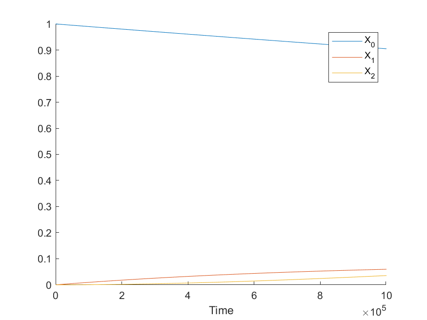

\newcommand{\od}[2]{\frac{\mathrm{d} #1}{\mathrm{d} #2}}
\newcommand{\pd}[2]{\frac{\partial #1}{\partial #2}}

```{r setup, include=FALSE, warning=F}
#knitr::opts_chunk$set(echo = TRUE)
#source("draw_matrix.R")
```


## Problem 1

### a)

Let $X_i$ be the probablity of $i$ state **without** CIN, and $Y_i$ be the probablity of $i$ state **with** CIN.

#### 1) neutral CIN

For $X_i, i \in \{0,  1, 2\}$:
\begin{align*}
\od{X_o}{t} &= - (u_1 + u_c) X_0 \\
\od{X_1}{t} &= u_1 X_0 - (u_c + N\cdot u_2)X_1 \\ 
\od{X_2}{t} &= N\cdot u_2 \cdot X_1
\end{align*}

For $Y_i, i \in \{0,  1, 2\}$:
\begin{align*}
\od{Y_0}{t} &= u_c \cdot X_0 - u_1 \cdot Y_0 \\
\od{Y_1}{t} &= u_1 \cdot Y_0 + u_c \cdot X_1 - N\cdot u_3 \cdot Y_1 \\
\od{Y_2}{t} &= N \cdot u_3 \cdot Y_1
\end{align*}

The solution to the ODE above is approximately: 
\begin{align*}
X_2(t) &= \frac{Nu_1u_2t^2}{2} \\
Y_2(t) &= u_1u_2t^2
\end{align*}

The ratio $C$ is calculated as $\frac{NY_2(t)}{NX_2(t)} = \frac{2u_c}{Nu_2} = \frac{2(2n_1+n_2)}{N}$

#### 2) costly CIN in small compartments

Let $r$ be the relative fitness of CIN cells, the fixation probablity of a Moran process: $p = \frac{1-r^{-1}}{1-r^{-N}}$.

From the lecture slides, we have:
\begin{align*}
X_2(t) &= \frac{Nu_1u_2t^2}{2} \\
Y_2(t) &= Npu_1u_ct^2
\end{align*}

The ratio $C$ is calculated as $\frac{NY_2(t)}{NX_2(t)} = \frac{2pu_c}{u_2} = \frac{4p(2n_1+n_2)u}{2u} = 2p(2n_1+n_2)$

#### 3) costly CIN in large compartments

Fixation of intermediate CIN will not be reached in large compartment and the population will tunnel from $X_1$ to $Y_2$ at a rate of $R = \frac{Nu_cu_3r}{1-r}$

From the lecture slides, we have:
\begin{align*}
X_2(t) &= \frac{Nu_1u_2t^2}{2} \\
Y_2(t) &= \frac{Ru_1t^2}{2}
\end{align*}

The ratio $C$ is calculated as $\frac{NY_2(t)}{NX_2(t)} = \frac{R}{Nu_2} = \frac{Nu_cu_3r}{(1-r)Nu_2} = \frac{(2n_1+n_2)r}{100(1-r)}$

Obviously, the ratio C for the three CIN scenarios is independent of time.

### b) 

The ratio for three cases $c_1, c_2, c_3$ can be calculated

\begin{align*}
c_1 &= \frac{2(2n_1+n_2)}{N} = 3 \\
c_2 &= 2p(2n_1+n_2) = 2\frac{1-r^{-1}}{1-r^{-N}}(2n_1+n_2) = 2\cdot 0.06 \cdot 15 = 1.8 \\
c_3 &= \frac{(2n_1+n_2)}{100(1-r)} = \frac{15 \cdot 0.9}{100\cdot 0.1} = 1.35
\end{align*}

## Problem 2

Assuming there are $365.25$ days on average in a year

### a)

Let $P(t)$ be the probablity of crypts being neoplastic at time $t$

Time: $t= 365.25 \cdot 50 = 18262.5$, The probablity of fixation in a Moran process: $p = \frac{1-r^{-1}}{1-r^{-N}} = 0.048$

$P(t) = 1 - \exp(-Nupt) = 0.00873$
$E(\text{number of neoplastic crypts}) = M \cdot P(t) = 8.73 \times 10^4$

### b)

Let $P(t)$ be the probablity of crypts being transformed at time $t$

Time: $t= 365.25 \cdot 50 \cdot \frac{1}{10}= 1826.25$,

$P(t) = 1 - \exp(-ut) = 1.83 \times 10^{-5}$
$E(\text{number of neoplastic crypts}) = M \cdot P(t) = 183$

### c)

Let $P(t)$ be the probablity of crypts being transformed at time $t$

Time: $t= 365.25 \cdot 50 \cdot \frac{1}{10}= 1826.25$, $N=5$, $p = \frac{1-r^{-1}}{1-r^{-N}} = 0.22$

$P(t) = 1 - \exp(-Nupt) = 2.01 \times 10^{-5}$
$E(\text{number of neoplastic crypts}) = M \cdot P(t) = 201$

When the cells in each crypt originate from a single stem cell, the expected number of neoplastic crypts at age 50 is minimum. Thus this kind of tissue architecture prevents best the initiation of cancer.

## Problem 3

### a)

In Moran process, the average fixation time of the first mutation is $N$, and the average waiting time for the second mutation is $\frac{1}{Nu_2}$. When $N << \frac{1}{\sqrt{u_2}}$, it means $N << \frac{1}{Nu_2}$, so type 1 cells reach fixation before a type 2 cell arises.

### b)

Given the initial condition, the equtions can be solved numerically using `ode45` in Matlab

The figure above can be reproduced using 

https://github.com/wyq977/evolutionary-dynamics-2019/Exercises/Ex4.m

$X_0 = 0.90484, X_2 = 0.16486, X_3 = 0.069696$



Code is available on github repo:
(https://github.com/wyq977/evolutionary-dynamics-2019)
