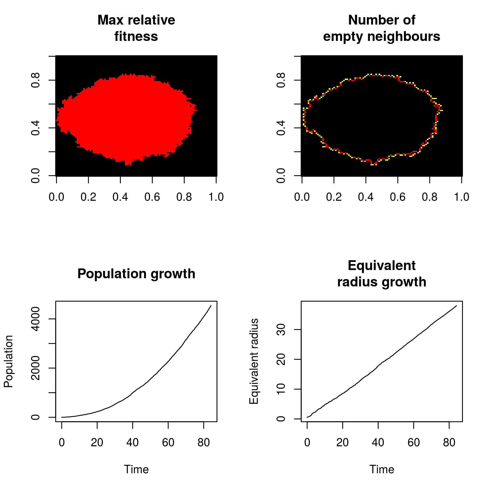

\newcommand{\od}[2]{\frac{\mathrm{d} #1}{\mathrm{d} #2}}
\newcommand{\pd}[2]{\frac{\partial #1}{\partial #2}}
\newcommand{\pdsec}[2]{\frac{{\partial}^2 #1}{\partial {#2}^2}}


## Problem 1

In the setting descriped in the script, only one type of occupied state ($S_1 = 1$) and no mutation was allowed during the process. Therefore, each site in the grid space of $1000 \times 1000$ would either be in $S_1$ occupied state or un-occupied. Following is the brief idea of the evolution process as per the script descrips.

The models described here is __bond-focussed__, explained below.

1. A candidate was randomly sampled from all the sites in the grid space that have been occupied ([code](https://github.com/robjohnnoble/EdenModel/blob/9c4524d1183cc1b0429f27dbdb98d5908dc1b587/EdenModelSim.R#L74)) with a probablity __proptional to the number of $S_0$ sites in its neibours__.
2. A unoccupied neibouring site ($S_0$) will switched to $S_1$.
  Skip if the neibouring sites were occupied ([code](https://github.com/robjohnnoble/EdenModel/blob/9c4524d1183cc1b0429f27dbdb98d5908dc1b587/EdenModelSim.R#L84))
3. Record the time for the proliferation event, which follows an exponetial distribution with the parameters $\lambda \propto \sum_{i,j} \text{neibours}_{i,j}$ ([code](https://github.com/robjohnnoble/EdenModel/blob/9c4524d1183cc1b0429f27dbdb98d5908dc1b587/EdenModelSim.R#L99))
4. Update the sites that has been occupied, the corresponding index list and the list of neibours. ([code](https://github.com/robjohnnoble/EdenModel/blob/9c4524d1183cc1b0429f27dbdb98d5908dc1b587/EdenModelSim.R#L110))

To make the proliferation rate __same__ across all cells of more than one $S_0$ in their neibours, the update rule needs to switch to __cell-focussed__ method described in the slides.

A modification was made during the sampling stage. As indicated by the Q-Q plot below, the sampling in bond foucussed approach clearly derivate from the uniform distribution much more than the cell foucussed one. It should be noted the below Q-Q plot is re-sampling after the simulation (both cell focus and bond focus) so it only represent the sampling difference at a snapshot. On the other hand, if the grid space was pre-occupied with $S_1$ uniformly, two approaches differs slightly.

```{r, fig.cap="Sampling result using simulation Bond Focus"}
source('ex9_1_EdenModelSim.R')
ITER = 1000
bond_based <- list()
cell_based <- list()

for(iter in 1:ITER) {
  candidate <- sample(1:num_has_space, 1, prob = unlist(how_many_spaces) * 
                        sapply(has_space, function(e) sites[e[1], e[2]]))
  bond_based[[iter]] <- candidate

  candidate <- sample(1:num_has_space, 1, prob = 
                        sapply(has_space, function(e) sites[e[1], e[2]]))
  cell_based[[iter]] <- candidate
}
x <- qunif(ppoints(ITER))
par(mfrow = c(1, 2))
qqplot(x=x, y=sort(unlist(cell_based)), xlab = 'Uniform Distribution', ylab='Cell Based')
qqplot(x=x, y=sort(unlist(bond_based)), xlab = 'Uniform Distribution', ylab='Bond Based')
```

```{r eval=T, include=T,echo=F, fig.cap="Sampling result using simulation Cell Focus"}
source('ex9_1_EdenModelSimCellBased.R')
ITER = 1000
bond_based <- list()
cell_based <- list()

for(iter in 1:ITER) {
  candidate <- sample(1:num_has_space, 1, prob = unlist(how_many_spaces) * 
                        sapply(has_space, function(e) sites[e[1], e[2]]))
  bond_based[[iter]] <- candidate

  candidate <- sample(1:num_has_space, 1, prob = 
                        sapply(has_space, function(e) sites[e[1], e[2]]))
  cell_based[[iter]] <- candidate
}
x <- qunif(ppoints(ITER))
par(mfrow = c(1, 2))
qqplot(x=x, y=sort(unlist(cell_based)), xlab = 'Uniform Distribution', ylab='Cell Based')
qqplot(x=x, y=sort(unlist(bond_based)), xlab = 'Uniform Distribution', ylab='Bond Based')
```


```{r pressure, echo=FALSE, fig.cap="Simulation using different approaches", fig.width=3, fig.height=3}


```

## Problem 2

### (a)

For a wild type to die off, the probablity w.r.t. time is:

\begin{align}
p = \dfrac{1 - r^{-1}}{1 - r^{-N}}
\end{align}

Probablity that a dead individual is replaced by parents of its own deme:
\begin{align}
W_i^{+(local)}(\bm{n}) = (1 - m) \cdot \dfrac{\mu (1 + s) \cdot (N - n_i)}{N}
\end{align}

Probablity that a dead individual is replaced by parents of other demes:
\begin{align}
W_i^{+(neibours)}(\bm{n}) = \dfrac{m}{2} \cdot \dfrac{\mu (1 + s) \cdot (N - n_i)}{N}
\end{align}

### (b)

\begin{align}
W_i^{+}(\bm{n}) - W_i^{-}(\bm{n})
&= \frac{\mu(1 + s)}{N} (N- n_i)[n_i + \frac{m}{2}n_i''] - \frac{\mu n_i}{N}[(N-n_i)- \frac{m}{2}n_i''] \\
&= \frac{\mu}{N}\Bigg[(1+s)(N-n_i)[n_i + \frac{m}{2}n_i''] - n_i(N-n_i)+n_i\frac{m}{2}n_i'' \Bigg] \\
&= \frac{\mu}{N}\Bigg[s(N-n_i)n_i + (1+s)(N-n_i)\frac{m}{2}n_i'' +n_i\frac{m}{2}n_i'' \Bigg] \\
&= \frac{\mu}{N}\Bigg[s(N-n_i)n_i + s(N-n_i)\frac{m}{2}n_i'' + N\frac{m}{2}n_i'' - \cancel{n_i\frac{m}{2}n_i''} + \cancel{n_i\frac{m}{2}n_i''} \Bigg] \\
&= \frac{\mu}{N}\Bigg[s(N-n_i)(n_i + \frac{m}{2}n_i'') + N\frac{m}{2}n_i'' \Bigg]
\end{align}

Therefore, $\od{\langle n_i \rangle}{t}$ can be written as:
\begin{align}
\od{\langle W_i^{+}(\bm{n}) - W_i^{-}(\bm{n}) \rangle}{t}
&= \langle\frac{\mu}{N}\Bigg[s(N-n_i)(n_i + \frac{m}{2}n_i'') + N\frac{m}{2}n_i'' \Bigg] \rangle \\
&= \dfrac{\mu m }{2}\langle n_i'' \rangle + \frac{s\mu}{N}(N-\langle n_i \rangle)(\langle u_i \rangle + \frac{m}{2} \langle n_i'' \rangle)
\end{align}

### (c)

The differential equation above can be rewritten as:

\begin{align}
s(1- \frac{1}{N}\langle n_i \rangle)(\frac{1}{N}\langle u_i \rangle) +
\dfrac{\mu m }{2}\langle n_i'' \rangle +
s(1- \frac{1}{N}\langle n_i \rangle)(\frac{m}{2} \langle n_i'' \rangle)
\end{align}

As $\langle n_i'' \rangle$ can be interpreted as $\Big\langle (n_{i+1} - n_i) - (n_i-n_{i-1}) \Big\rangle$, which is the epected difference in $l\pd{u}{x}$, $l^2\pdsec{u}{x}$ (since $x = l\cdot i$)

Therefore, the differential equation can be rewritten as:
\begin{align}
\pd{u}{t}
&= \frac{\mu m}{2}l^2\pdsec{u}{x} + s\mu(1-u)(u - \frac{m}{2}l^2\pdsec{u}{x}) \\
&= \frac{\mu m}{2}(1 + s(1-u))l^2\pdsec{u}{x} + s\mu(1-u)u
\end{align}


Code is available on github repo:
(https://github.com/wyq977/evolutionary-dynamics-2019)
